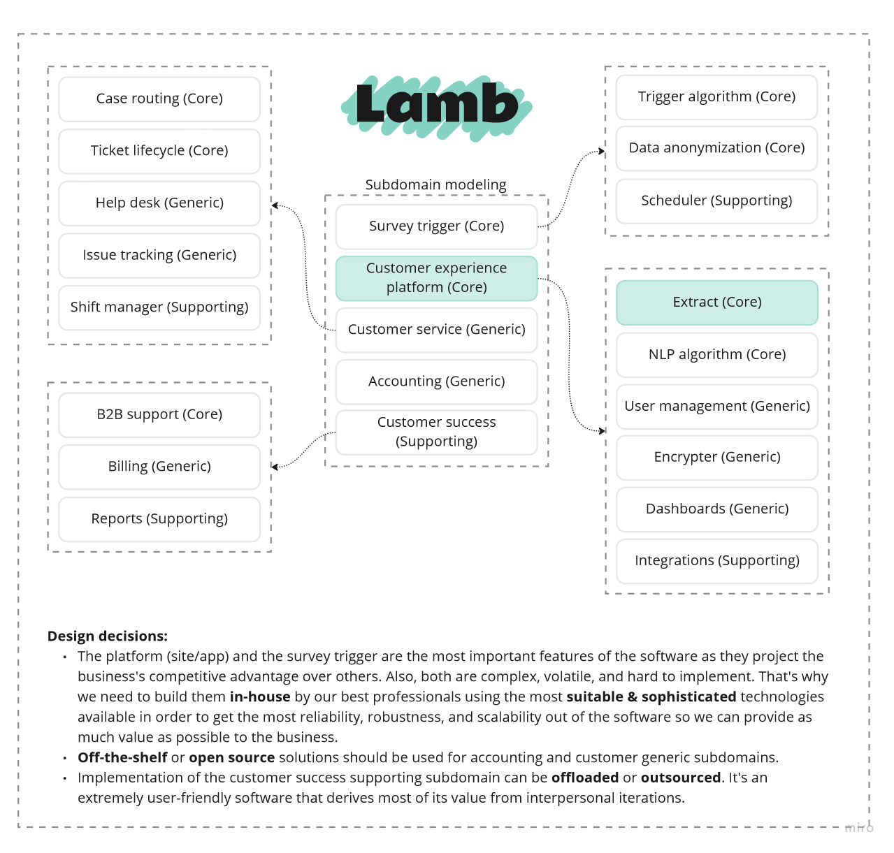
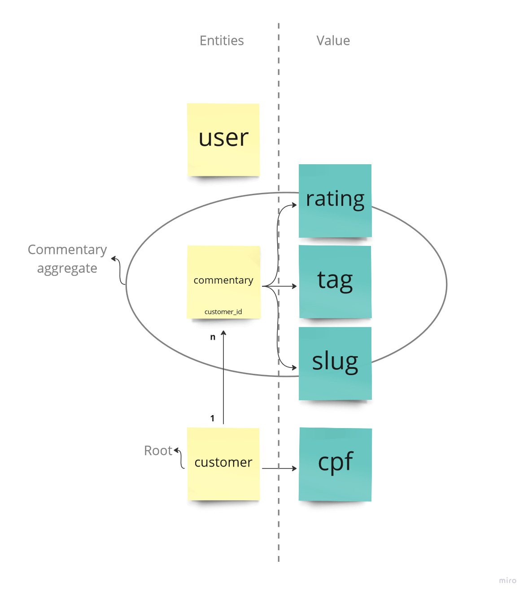
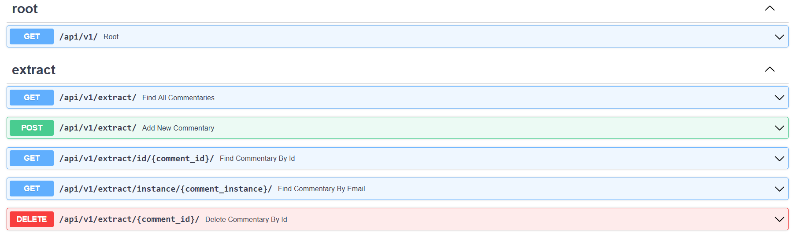
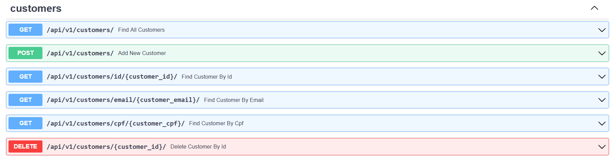
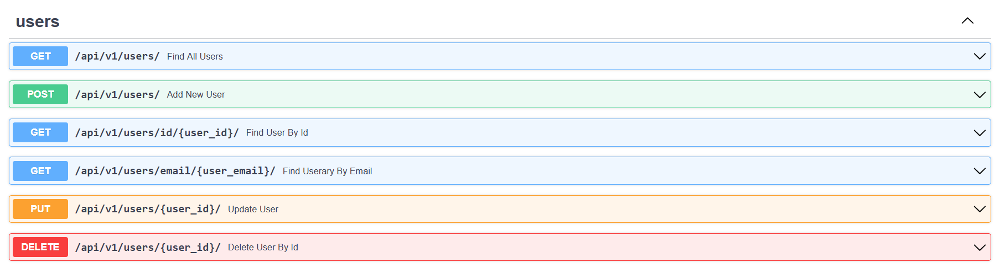

[](https://github.com/cenciati/lamb-ddd-clean-arch-solid/actions/workflows/ci.yaml)
# Lamb
Lamb is a fictional software as a service for managing customer experience. It provides an efficient way to improve your customers' journey through your company's services.

This repository implements just a piece of software of what could be the solution described above. It is the implementation of an API for consulting an extract that contains information about the transactions of commentaries left by customers.

## ⚙️ Tech stack
- Python >= 3.10
- FastAPI
- SQLAlchemy
    - PostgreSQL
- Poetry
- Pytest
- Docker
- Docker-compose
- GitHub Actions

## 🚀 Getting started
### Prerequisites
To run this project locally, you need to have installed all the tools listed above that were used. To facilitate this dull setup process, I made a script using `GNU make` So, if you already have it installed on your computer, the repository contains a `Makefile` with a script setting up the project step by step.

Before running the scripts, make sure you already have it installed:
- GNU make
- Python >= 3.10
- Poetry == 1.2.2
- Docker
- Docker-compose

### Installation
To install the project dependencies, you just need to write the following command in your terminal:
```bash
$ git clone https://github.com/cenciati/lamb-ddd-clean-arch-solid.git
$ cd lamb-ddd-clean-arch-solid/
$ make setup
```

Now the API should be working on `http://localhost:8000/api/v1/`

In case you want to remove everything that was installed, you can write the following command:
```bash
$ make clean
```

### How to run
```bash
$ make run_api
```

## 📄 Documentation
### Subdomain modeling


### Aggregates


### Endpoints




#### Examples
Request commentary POST /extract/:
```json
{
  "content": "Nothing to complain about.",
  "rating": 8,
  "tags": [
    {
      "id": 1,
      "name": "Support",
      "sentiment": 1,
      "subtag": false
    }
  ],
  "customer_id": "d5ec36c3-fe23-484d-8358-32aec747d42a",
  "instance_slug": "lamb",
  "journey_slug": "app",
  "automatic": false
}
```

Response commentary GET /extract/{comment_id}/:
```json
{
  "data": [
    {
      "id": "c3543ffe-31d7-4d4c-9bdd-098c0fac2b22",
      "content": "Nothing to complain about.",
      "rating": {
        "score": 8,
        "detractor": false
      },
      "tags": [
        {
          "id": 1,
          "name": "Support",
          "sentiment": 1,
          "subtag": false
        }
      ],
      "customer_id": "d5ec36c3-fe23-484d-8358-32aec747d42a",
      "instance_slug": {
        "name": "lamb"
      },
      "journey_slug": {
        "name": "app"
      },
      "automatic": false
    }
  ]
}
```

Request user POST /users/:
```json
{
  "email": "johndoe@mail.com",
  "password": "bananas2000",
  "instance_slug": "lamb"
}
```

Response customer GET /customers/id/{customer_id}:
```json
{
  "data": [
    {
      "id": "d5ec36c3-fe23-484d-8358-32aec747d42a",
      "full_name": "John Doe",
      "email": "johndoe@mail.com",
      "cpf": {
        "number": "01234567890"
      }
    }
  ]
}
```

## What's next?
- [ ] Increase test coverage
- [ ] Improve error handling by using `notification pattern`
- [ ] Implement `JWT` authentication
- [ ] Code an e-mail provider
- [ ] Deployment to the cloud

## 📚 References
- [Domain-Driven Design: Tackling Complexity in the Heart of Software](https://www.amazon.com.br/Domain-Driven-Design-Tackling-Complexity-Software/dp/0321125215)
- [Domain Driven Design Quickly - InfoQ](https://www.infoq.com/minibooks/domain-driven-design-quickly/)
- [DDD in Python](https://dddinpython.com/)
- [Learning Domain-Driven Design](https://www.amazon.com.br/Learning-Domain-Driven-Design-Aligning-Architecture/dp/1098100131)
- [How to get started DDD & Onion-Architecture in Python web application](https://iktakahiro.dev/python-ddd-onion-architecture)
- [Clean Architecture com Pokémon](https://github.com/dersonsena/clean-arch-pokemon)
- [Ultimate FastAPI tutorial](https://github.com/ChristopherGS/ultimate-fastapi-tutorial)
- [FastAPI best practices](https://github.com/zhanymkanov/fastapi-best-practices)